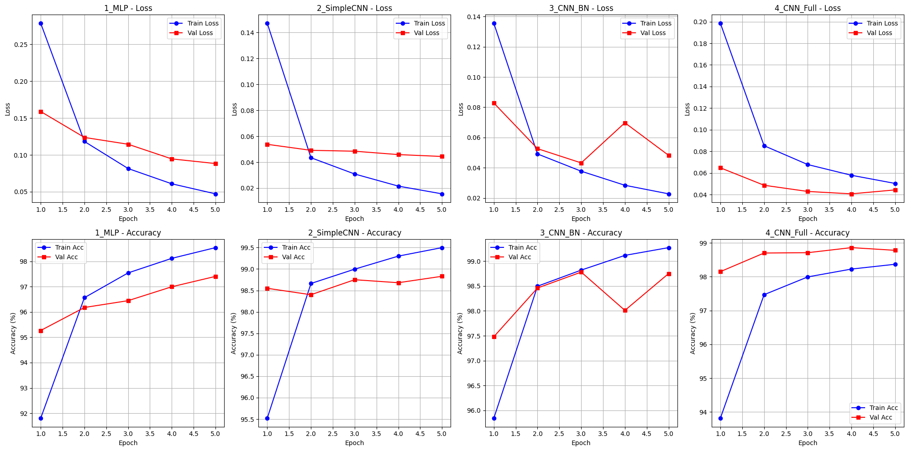

# Классификация рукописных цифр на датасете MNIST

[](https://colab.research.google.com/drive/1eS1ee5auqWqpF7Bue3-0Dx9Tjj4RiNzt#scrollTo=CLMJ7Xl7mT1n)

## Описание проекта

Этот проект посвящен решению задачи классификации изображений рукописных цифр из датасета **MNIST** (Modified National Institute of Standards and Technology). Цель работы — сравнить несколько архитектур нейронных сетей и исследовать влияние различных методов регуляризации (BatchNorm, Dropout) на качество классификации и переобучение.

## Цели работы

1. Реализовать несколько архитектур нейронных сетей для классификации MNIST.
2. Исследовать влияние архитектурных решений (MLP vs CNN, BatchNorm, Dropout) на процесс обучения.
3. Сравнить модели по метрикам качества: Accuracy, Precision, Recall, F1-score.
4. Выявить архитектуру, наиболее подходящую для данной задачи.

## Рассмотренные архитектуры

В ходе работы были обучены и протестированы 4 модели:

| Модель | Описание |
| :--- | :--- |
| **1_MLP** | Простейшая полносвязная сеть (Flatten -> Linear 784->128 -> Linear 128->10). Не учитывает 2D-структуру изображения. |
| **2_SimpleCNN** | Простая сверточная сеть (Conv -> ReLU -> MaxPool -> Conv -> ReLU -> MaxPool -> Flatten -> Linear). Учитывает пространственную структуру. |
| **3_CNN_BN** | Архитектура `2_SimpleCNN` с добавлением слоев **Batch Normalization** для стабилизации обучения и борьбы с переобучением. |
| **4_CNN_Full** | Архитектура `3_CNN_BN` с добавлением **Dropout** (0.3) перед полносвязными слоями для максимальной регуляризации. |

## Результаты экспериментов

Ниже представлена сводная таблица результатов тестирования обученных моделей на отложенной тестовой выборке.

| Model | Val Loss | Test Acc | Precision | Recall | F1 |
| :--- | :--- | :--- | :--- | :--- | :--- |
| **1_MLP** | 0.0883 | **97.55%** | 0.9754 | 0.9754 | 0.9754 |
| **2_SimpleCNN** | **0.0444** | **99.11%** | 0.9909 | 0.9911 | 0.9910 |
| **3_CNN_BN** | 0.0432 | **98.77%** | 0.9877 | 0.9877 | 0.9877 |
| **4_CNN_Full** | **0.0407** | **98.95%** | 0.9895 | 0.9895 | 0.9895 |

## Графики обучения

На графиках представлена динамика изменения функции потерь (Loss) и точности (Accuracy) на тренировочной и валидационной выборках для каждой из моделей.



## 💡 Анализ результатов и выводы

1.  **MLP vs CNN:**
    *   **MLP (Модель 1):** Показала наихудший результат (97.55%). Игнорирование 2D-структуры изображения привело к переобучению и низкой обобщающей способности. Разрыв между тренировочной и валидационной кривыми значителен.
    *   **CNN (Модель 2):** Переход к сверточной архитектуре дал значительный прирост качества (99.11%). Сеть научилась выделять пространственные признаки (края, формы), что критически важно для изображений. Однако разрыв в графиках все еще заметен, что говорит о склонности к переобучению.

2.  **Влияние Batch Normalization (Модель 3):**
    *   Добавление `BatchNorm2d` после сверточных слоев заметно стабилизировало процесс обучения. Кривые потерь стали более гладкими, а разрыв между `train` и `val` графиками существенно сократился по сравнению с `2_SimpleCNN`. Это подтверждает эффективность BN как регуляризатора и ускорителя сходимости.

3.  **Эффективность полной регуляризации (Модель 4):**
    *   Комбинация `BatchNorm` и `Dropout` (0.3) позволила добиться минимального разрыва между тренировочной и валидационной кривыми. Модель обучалась стабильно и показала отличную способность к обобщению, заняв **2-е место по точности (98.95%)**, но **1-е место по минимальной ошибке на валидации (0.0407)**. Это делает ее самой сбалансированной и устойчивой к переобучению архитектурой.

**Лучшая архитектура:** `4_CNN_Full`.

Несмотря на то, что `2_SimpleCNN` показала самую высокую точность на тесте (99.11%), `4_CNN_Full` является более предпочтительной с практической точки зрения. Она демонстрирует наименьшее переобучение и более стабильное поведение. В реальных проектах, где распределение данных может незначительно отличаться от обучающей выборки, такая модель, вероятно, покажет себя лучше.

## Как запустить проект

1.  **Локальный запуск:**
    ```bash
    git clone https://github.com/Lynastra/mnist-pytorch-classification.git
    cd YOUR_REPO_NAME
    pip install -r requirements.txt
    jupyter notebook task_mnist_classification.ipynb
